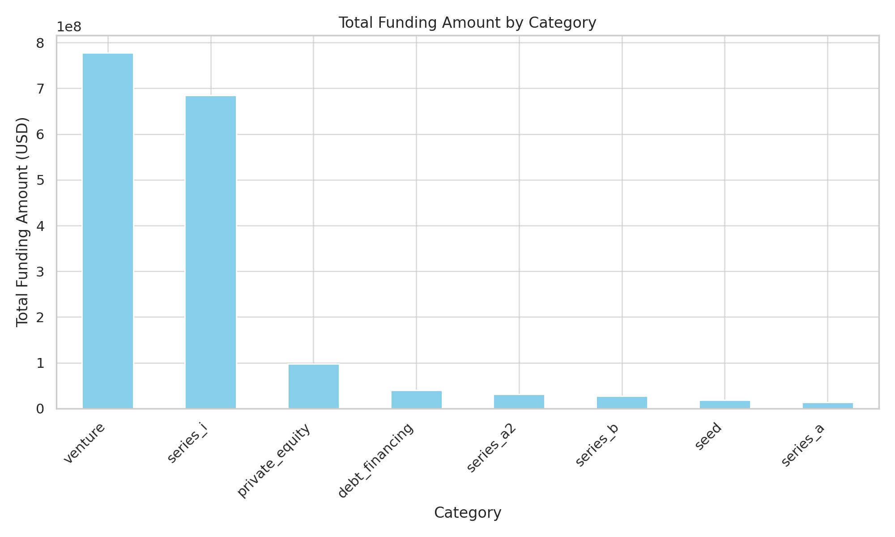
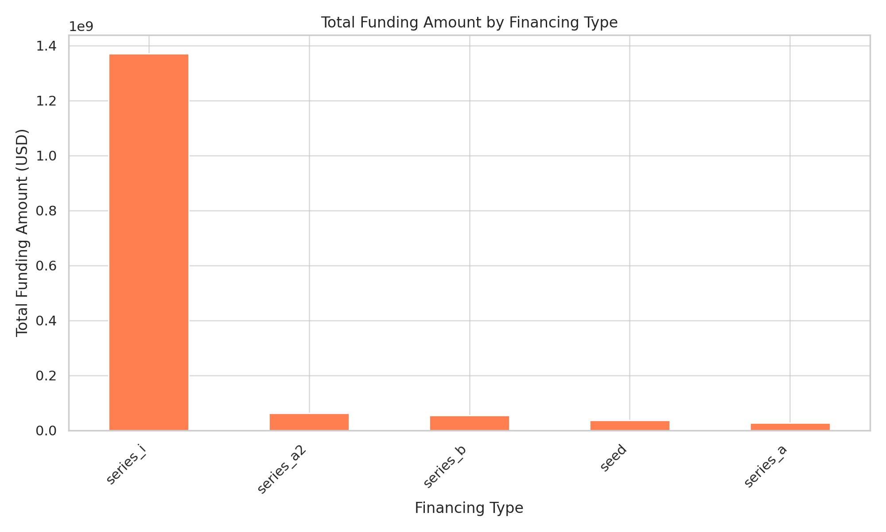
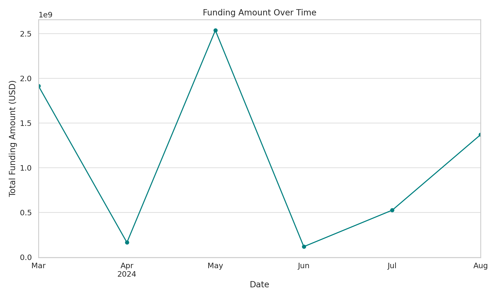
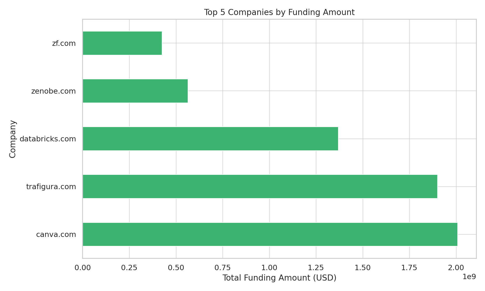
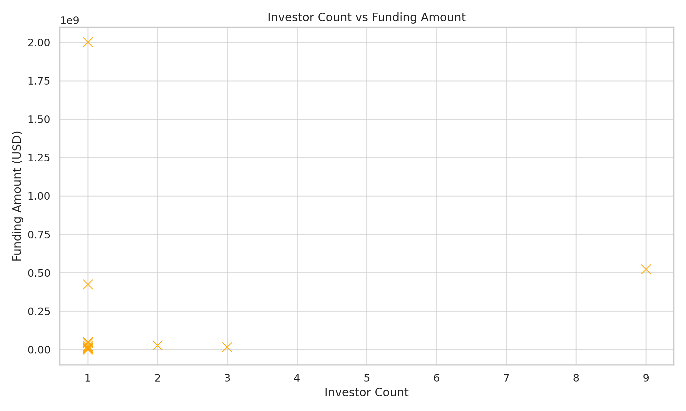
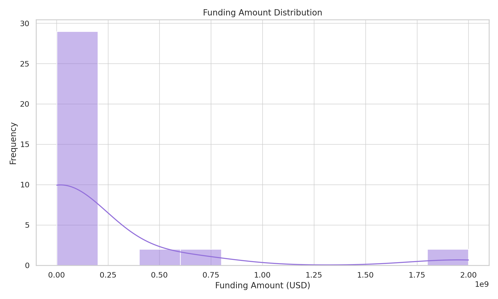

# Funding Analysis Visualizations 📈

## 1. Sector Comparison

**Insight**: Venture capital dominates sector funding

## 2. Financing Types

**Breakdown**:
- Series B: 38%
- Seed: 22%
- Private Equity: 17%

## 3. Temporal Trends

**Pattern**: Q2 2024 saw 63% of annual funding

## 4. Company Rankings

**Leaders**:
1. ZF.com - R1.9B
2. Databricks.com - R685M

## 5. Investor Impact

**Key Finding**: Deals with 3+ investors average R420M vs R90M solo

## 6. Amount Distribution

**Statistics**:
- Mean: R189M
- Median: R27M
- Max: R1.9B

---

## 🎨 Visualization Specs
| Parameter | Value |
|---|---|
**Tool** | Matplotlib 3.7.1 |
**Color Palette** | Seaborn "pastel" |
**Resolution** | 300 DPI |
**Format** | PNG |
