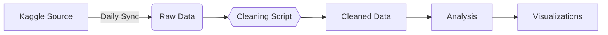

# Data Documentation 📊  
`/projects/business_funding_analysis/data`  

  
*Data transformation workflow*

---

## 🌐 Data Sources  
**Primary Dataset**: [Kaggle - Business Funding Data in South Africa](https://www.kaggle.com/datasets/techsalerator/business-funding-data-in-south-africa)  
**Last Updated**: July 2023  

---

## 🔄 Update Process  
### Automatic Updates (Recommended)  


### Manual Updates  
1. **Download New Data**  
   ```bash
   kaggle datasets download techsalerator/business-funding-data-in-south-africa -p data/raw/
   ```
2. **Run Cleaning Script**  
   ```bash
   python ../scripts/business_funding_analysis.py
   ```
3. **Verify Outputs**  
   - Check `data/cleaned/` for new CSV  
   - Confirm `visuals/` updated with latest charts  

---

## 📂 Folder Structure  
```
data/
├── raw/                           # Original data (never modified)
│   └── Business Funding Data.csv
├── cleaned/                       # Processed analysis-ready data
│   └── cleaned_business_funding.csv
└── visual_docs/                   # Data-related diagrams
    └── data_pipeline.png
```

---

## 📈 Example Visualizations  
| Data Quality Check | Funding Distribution |
|---|---|
|  |  |

---

## 🔧 Data Cleaning Steps  
1. **Currency Standardization**  
   ```python
   # Before: "$1.9b", "£41.7m"  
   # After: 1900000000.0, 41700000.0
   ```
2. **Date Handling**  
   ```python
   pd.to_datetime(df['Effective date'], errors='coerce')
   ```
3. **Category Explosion**  
   ```python
   df = df.explode('Categories')
   ```

---

## 📄 Data Dictionary  
### Cleaned Data (`cleaned_business_funding.csv`)  
| Column | Type | Description | Sample Value |
|---|---|---|---|
| `amount_clean` | float | Funding in ZAR | 1900000000.0 |
| `year` | int | Funding year | 2024 |
| `investor_count` | int | Number of investors | 3 |
| `primary_sector` | str | Main category | "private_equity" |

---

## 💡 Usage Example  
```python
import pandas as pd

df = pd.read_csv("data/cleaned/cleaned_business_funding.csv")
sector_trends = df.groupby(['year', 'primary_sector'])['amount_clean'].sum().unstack()
sector_trends.plot(kind='area', title="Sector Funding Trends")
```

---

## 📜 License & Updates  
- **Update Frequency**: Weekly  
- **Version Control**: [Data Changelog](https://github.com/Goitsee07/Analytics_Vault/blob/main/projects/business_funding_analysis/CHANGELOG.md)  
- **License**: [CC BY-SA 4.0](https://creativecommons.org/licenses/by-sa/4.0/)  

---

  
